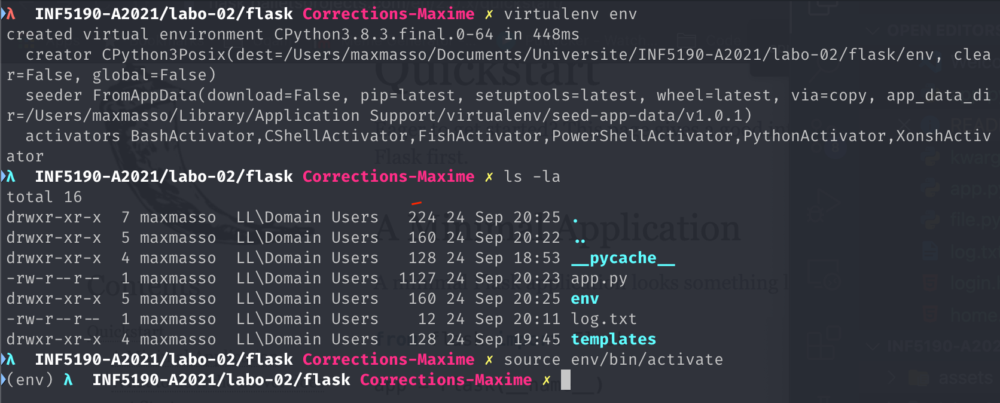
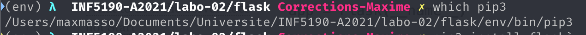
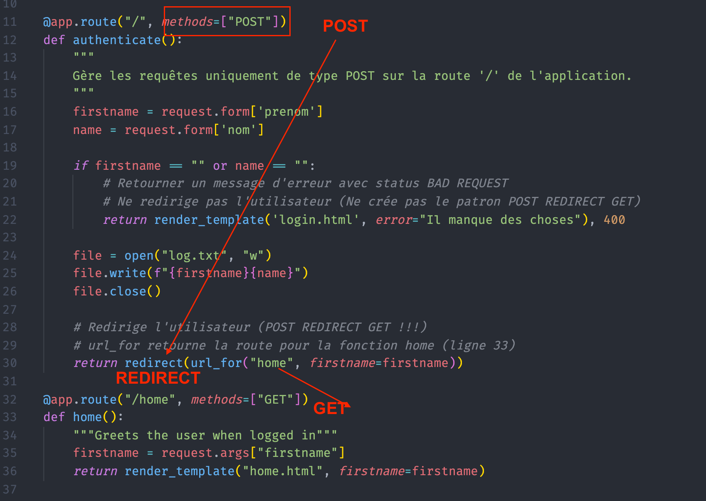

# INF5190-A2021

Correction des laboratoires du cours INF5190 pour la session d'automne 2021

## Labo 02

Pour débuter rapidement une application Flask.

1. Partir votre environnement virtuelle

    Référence : https://flask.palletsprojects.com/en/2.0.x/quickstart/

    ```bash
    virtualenv <nom de votre environnement>
    source env/bin/activate
    ```

    Vous devriez voir apparaitre le nom de votre environnement entre parenthèse au début de la ligne de votre terminal.

    Pour quitter lancer la commande `deactivate`

    

2. Vérifier que votre environnement fonctionne

    ```bash
    which python
    which pip
    ```

    Vous devriez voir le chemin dans votre terminal jusqu'à votre environnement virtuelle

    

### POST REDIRECT GET



## Labo 03

-   Atelier : Base de données SQLite
-   Installation vagrant
-   Injection SQL
-   Manipuler des données avec Python et SQLite 3
-   Peut-être, intégration avec Flask
