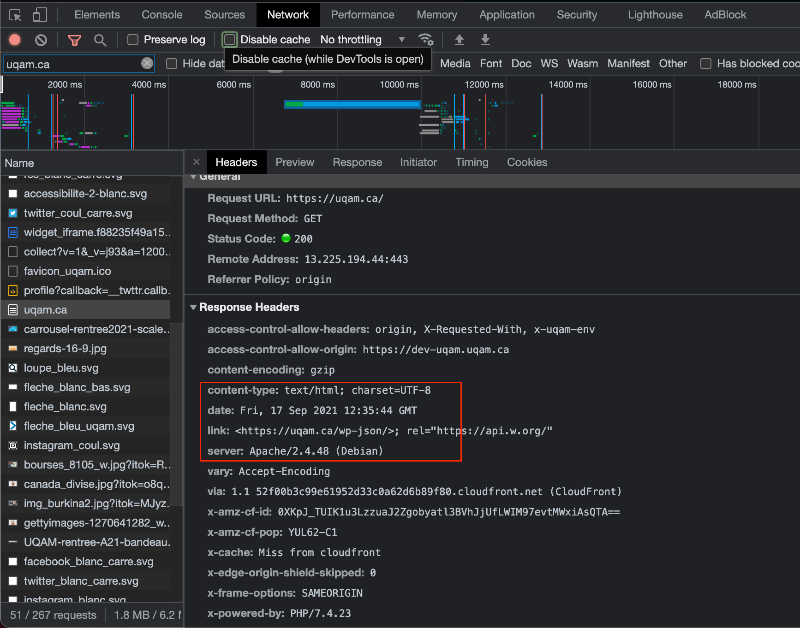
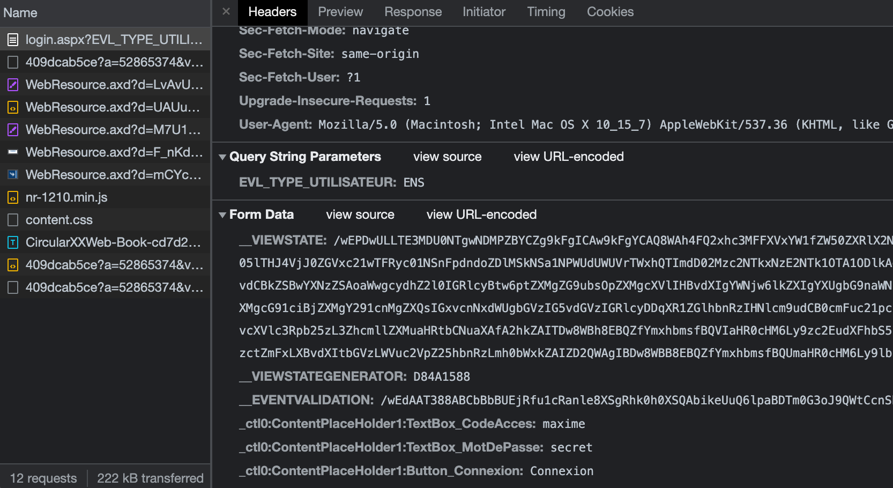

Voir solutionnaire de Ela :

https://github.com/elaelheni/INF5190-H2021/blob/main/HTTP/Solutions.md

# Question 01 - 02

Aller sur https://uqam.ca

Ouvrir la fenêtre d'inspecteur de votre navigateur (Ex : Google Chrome DevTools) -> Tab `Network` -> Filtrer "uqam.ca" -> Tab `Headers` -> Section Response Headers

Voir les champs :

-   Content Type
-   Server

# Question 03 - 04

Se rendre sur https://etudier.uqam.ca/trouver-un-cours. Sélectionner **Cours en présentiel**.

Sélectionner un cours dans la liste et observer le comportement de l'URL du navigateur.

-   Sélectionner INF5190
-   URL : https://etudier.uqam.ca/cours?sigle=INF5190#20213

# Question 05

Se rendre sur https://www.apps.uqam.ca/application/evalens/login/login.aspx?EVL_TYPE_UTILISATEUR=ENS.

Ouvrir l'inspecteur du navigateur (ex: Google Chrome DevTools) -> S'assurer que le bouton "Stop Recording Network Log" est allumé -> Tab `Network` -> `All` -> Se connecter avec de faux identifiant -> Requête `login.aspx` -> `Headers` -> `Form Data`

